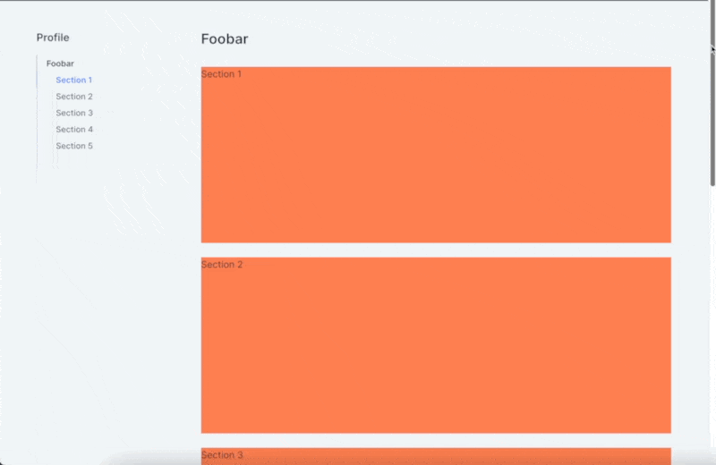

# usePageContentNavigation

A React hook that facilitates navigation of page content by cataloguing designated sections.



## Table of Contents

- [usePageContentNavigation](#usepagecontentnavigation)
  - [Table of Contents](#table-of-contents)
  - [Installation](#installation)
  - [Behaviour](#behaviour)
    - [On Scroll](#on-scroll)
    - [Caveat](#caveat)
  - [Usage](#usage)
    - [Configuration](#configuration)
    - [Properties](#properties)
  - [TypeScript Support](#typescript-support)
  - [License](#license)

--- 

## Installation

Install through your package manager of choice (npm, yarn, etc)

```
npm -i @mzaleski/use-page-content-navigation
```

```
yarn add @mzaleski/use-page-content-navigation
```

## Behaviour 

The hook is given an array of React children where each element is expected to be a designated content section. These sections are catalogued through the `sectionTitleProp` prop. If the `diveByPropName` flag is set, the hook will dive one level to retrieve the value; this is to support the use of modular components as well as more monolithic ones. If a section is missing a DOM identifier, the hook will attribute one based on the section's title (retrieved through `sectionTitleProp`).

```jsx
function Page() {
  ...

  return (
    <Shell>
      <Section 
        id="custom-id"
        header={<Section.Header title="section1"/>} />
      <Section header={<Section.Header title="section2"/>} />
      <Section header={<Section.Header title="section3"/>} />
    </Shell>
  )
}
```

> The `Shell` component is explored in the [Usage](#usage) section.

The above snippet matches the configuration:

```json
{
  "sectionTitleProp": "title",
  "diveByPropName": "header"
}
```

Sections 2 & 3 will be attributed a DOM ID of `"section2-section"` & `"section3-section"` respectively whist section 1 will retain its custom ID.

### On Scroll

When the user scrolls, the `currentIndex` is updated to reflect the section most relevant to boundary within the viewport (see demo gif). The hook returns a setter for the purpose of application-specific behaviour such as scroll-to or state restoration through URL hash. This is by design as it allows 

### Caveat

This hook was designed to make use of the default overflow behaviour as it attaches a scroll listener to the `window` itself and not any element in particular. This is by design as React's event handlers must be given as props which, in my case, wasn't suitable.

## Usage

```jsx
function Shell({ children }) {
  const {currentIndex, setCurrentIndex, navItems, mutatedChildren} = usePageContentNavigation(children, {
    diveByPropName: "header",
    // Modelled after demo gif:
    // - fixed header: 92px
    // - margin before content: 48px
    contentTopOffset: 140
  })

  return (
    <div className="...">
      <shellNav items={navItems} currentIndex={currentIndex} onClick={setCurrentIndex} />
      <ShellContent>{mutatedChildren}</ShellContent>    
    </div>
  )
}
```

### Configuration

The hook's configuration is done through the `opts` object which has the following properties:

| Name | Type | Description | Default |
|----|------|-------------| ------- |
| `enabled?` | Boolean | Whether the hook is enabled. | `true`
| `viewportBoundary?` | Number (float) | The boundary within the viewport to consider a section "active". | `0.3`
| `sectionTitleProp?` | String | The property name to retrieve the section's title from. | `"title"`
| `diveByPropName?` | String | The property name to dive into to retrieve the section's title. | `undefined`
| `contentTopOffset?` | Number | The offset from the top of the page to the content; useful when dealing with layouts composed of `position: sticky \| fixed` elements (see demo gif) | `0`

### Properties

The hook returns an object with the following properties:

| Name | Type | Description |
|----|------|-------------| 
| `currentIndex` | Number | The index of the section currently active. |
| `setCurrentIndex` | Function | A setter for the `currentIndex` property; throws an error if index is out of range |
| `navItems` | Array | An array of objects containing the section's title and DOM ID. |
| `mutatedChildren` | React.ReactNode | To render instead of the original `children` prop. |

## TypeScript Support 

You will find a collection of typings bundled with the package.

## License

[MIT License](LICENSE) (c) 2022 Maximilien Zaleski
